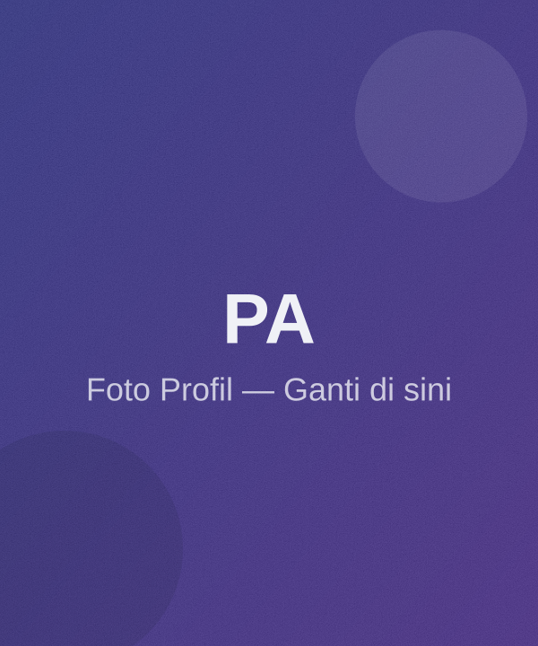

# Portfolio Pribadi — Pandu Arya Wiguna

Website portfolio statis (HTML, CSS, JavaScript murni — tanpa backend, tanpa perlu instalasi apa pun).

## 🚀 Cara Menjalankan
1. Ekstrak folder ini.
2. Klik dua kali `index.html`, atau buka lewat browser (Chrome/Edge/Firefox). Selesai — tidak perlu server atau instalasi.
3. (Opsional) Jika ingin menjalankan lewat local server, di VS Code gunakan ekstensi **Live Server** lalu klik "Go Live".

## 📁 Struktur File
```
portfolio/
├── index.html          → Struktur & konten seluruh halaman
├── style.css            → Semua styling & animasi
├── script.js             → Interaktivitas (navbar, form, animasi)
├── assets/images/        → Gambar (profil, project, favicon)
└── README.md
```

## ✏️ Bagian yang Perlu Kamu Ganti

### 1. Foto Profil
Ganti file `assets/images/profile.svg` dengan foto asli kamu.
Beri nama file yang sama (`profile.svg`/`.jpg`/`.png`) lalu sesuaikan ekstensi di `index.html` pada tag:
```html

```
(muncul 2x: di Hero dan di About)

### 2. Gambar Project
Ganti `project-1.svg` sampai `project-6.svg` di `assets/images/` dengan screenshot project asli kamu.

### 3. Data Diri, Deskripsi, & Link
Cari dan ganti di `index.html`:
- Nama, sekolah, email, domisili → section **About** (`.about-info-grid`)
- Deskripsi hero & about → paragraf `.hero-desc` dan `.about-text`
- Link sosial media (`github.com/username`, `linkedin.com/in/username`, dst) → cari semua `href="https://..."`
- Nomor WhatsApp → cari `wa.me/6280000000000`

### 4. CV
Simpan file CV kamu (PDF) di folder `assets/` dengan nama `CV-Pandu-Arya-Wiguna.pdf`, sesuai link tombol "Download CV" di `index.html`.

### 5. Skills
Di `index.html` bagian `<section id="skills">`, setiap kartu skill punya `data-percent="90"` — ubah angka sesuai levelmu, atau salin satu blok `.skill-card` untuk menambah skill baru.

### 6. Portfolio
Setiap project ada di dalam `<article class="project-card">`. Salin satu blok untuk menambah project baru, atau hapus blok untuk mengurangi.

### 7. Experience
Cari `.timeline-item` di section Experience, salin/hapus/edit sesuai pengalamanmu.

### 8. Form Contact (Penting!)
Form kontak saat ini **belum terhubung ke backend/email** (sesuai permintaan awal — hanya frontend).
Saat submit, form hanya melakukan validasi dan menampilkan pesan sukses simulasi.

Untuk membuat form benar-benar mengirim email, kamu bisa memakai salah satu layanan gratis berikut tanpa perlu bikin backend sendiri:
- **[EmailJS](https://www.emailjs.com/)** — paling mudah, tinggal tambahkan script & ID di `script.js`.
- **[Formspree](https://formspree.io/)** — cukup ganti `action` pada tag `<form>` di `index.html`.
- **[Web3Forms](https://web3forms.com/)** — mirip Formspree, gratis dan simpel.

## 🎨 Mengubah Warna / Font
Semua warna dan font diatur terpusat di bagian paling atas `style.css`, di dalam `:root { ... }`. Ubah nilai variabel seperti `--primary`, `--secondary`, `--accent`, `--bg` untuk mengubah tema warna ke seluruh halaman sekaligus.

## 📱 Responsive
Sudah diuji dan disesuaikan untuk tampilan mobile (≤480px), tablet (≤860px), dan laptop/desktop (≥1024px).

Selamat berkarya! 🚀
